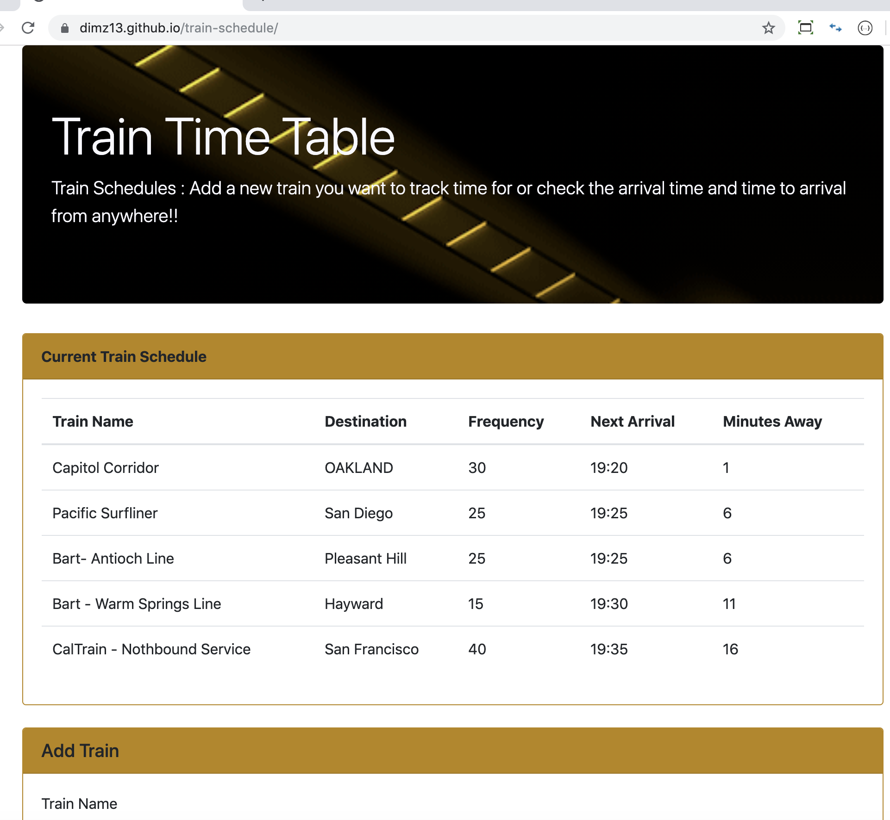

# train-schedule

# train-schedule
[Train Schedule](https://dimz13.github.io/train-schedule/)

## How it works
  - This page will display train time table.
  - User/Admin can add a new train to the table by using the "Add a Train" form.
  - The train schedules will take the current time and thus will be displayed updated times.
  - Firebase is used to store the data entered.

    

## Tools Used

- [Visual Studio Code](#vscode)
- [Chrome Browser](#chrome)
- [GitLab](https://ucb.bootcampcontent.com/)
- [GitHub](https://github.com/)
- [W3Schools](https://www.w3schools.com/default.asp)
- [SlackForum] (#slackforum)
- [StackOver Flow](https://stackoverflow.com/)

## Core Technologies Used
 - [HTML] (#html)
 - JavaScript
 - JQuery
 - BootStrap CSS Framework
 - Firebase
 - momentjs

